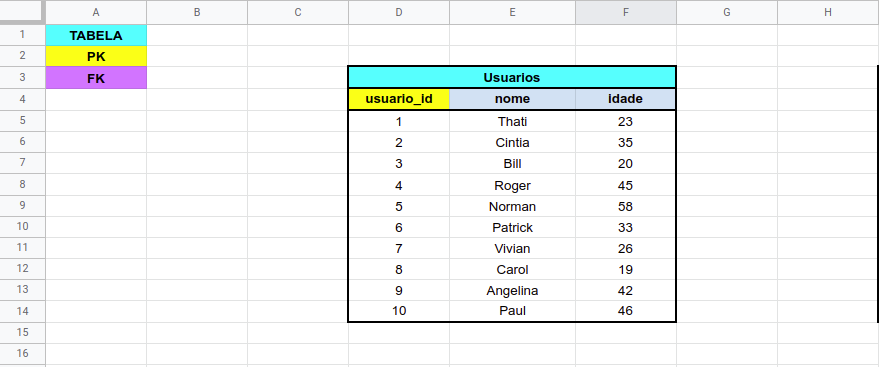
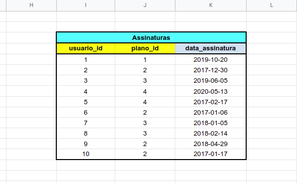
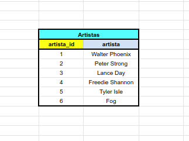
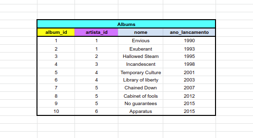
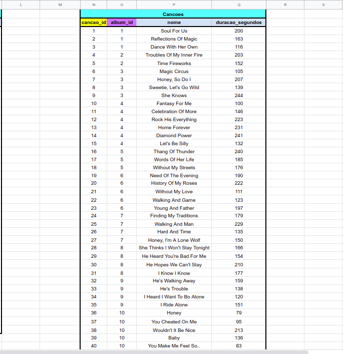
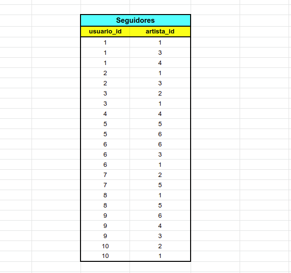
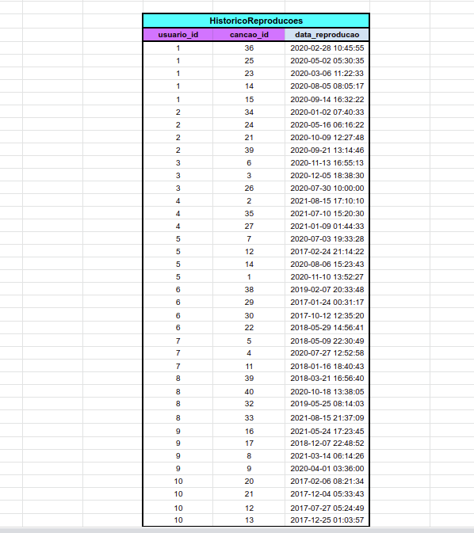

# One for All

# Contexto
O projeto One for All foi criado para colocar em prática funções SQL, JOINS e Normalização de banco de dados. Para isso foi utilizado o banco de dados fictício `SpotifyClone` com tabelas não normalizadas.

## Habilidades Desenvolvidas

  * Modelar um banco de dados

  * Identificar entidades, atributos e relacionamentos
  
  * Aplicar a 1ª, 2ª e 3ª Forma Normal

  * Criar tabelas

---

## Problema que foi resolvido

Foi recebido uma tabela não normalizada semelhante ao que poderia ser uma versão simplificada do banco de dados do Spotify. O trabalho consistiu em duas partes:

1. Normalizar essa tabela, criar o schema no banco de dados local e populá-lo;

2. Realizar os desafios no banco normalizado e populado.

**Aviso:** Todos os dados da tabela abaixo são fictícios e foram gerados aleatoriamente através de ferramentas, com o intuito de simular um projeto mais real 😉. Quaisquer similaridades com informações reais são meras coincidências.

### Planilhas com tabelas não normalizadas


# Desafios Cumpridos

## 1 - Normalizar e Modelar Tabelas.

### Planilhas após normalização e modelagem

**Tabela de Usuários**



**Tabela de Assinaturas**



**Tabela de Planos**


**Tabela de Artistas**



**Tabela de Albums**



**Tabela de Cancoes**



**Tabela de Seguidores**



**Tabela de HistoricoReproducoes**



### 2 - Criar uma `QUERY` que exiba três colunas:

1. A primeira coluna exibi a quantidade total de canções. essa coluna recebe o alias "**cancoes**".

2. A segunda coluna exibi a quantidade total de artistas e tem o alias "**artistas**".

3. A terceira coluna exibi a quantidade de álbuns e tem o alias "**albuns**".

A `QUERY` retorna a seguinte informação:


### 3 - Criar uma `QUERY` que tem apenas três colunas:

1. A primeira coluna possui o alias "**usuario**" e exibi o nome da pessoa usuária.

2. A segunda coluna possui o alias "**qtde_musicas_ouvidas**" e exibi a quantidade de músicas ouvida pela pessoa com base no seu histórico de reprodução.

3. A terceira coluna possui o alias "**total_minutos**" e exibi a soma dos minutos ouvidos pela pessoa usuária com base no seu histórico de reprodução.

Os resultados estão agrupados pelo nome da pessoa usuária e ordenados em ordem alfabética.

A `QUERY` retorna a seguinte informação:


### 4 - Criar uma `QUERY` que mostra as pessoas usuárias que estavam ativas no ano de **2021** se baseando na data mais recente no histórico de reprodução.

1. A primeira coluna possui o alias "**usuario**" e exibi o nome da pessoa usuária.

2. A segunda coluna tem o alias "**condicao_usuario**" e exibi se a pessoa usuária está ativa ou inativa.

O resultado esta ordenado em ordem alfabética.


A `QUERY` retorna a seguinte informação:


### 5 - Estamos fazendo um estudo das músicas mais tocadas e precisamos saber quais são as duas músicas mais tocadas no momento. Para isso foi criado uma `QUERY` que possui duas colunas:

1. A primeira coluna  possui o alias "**cancao**" e exibi o nome da canção.

2. A segunda coluna  possui o alias "**reproducoes**" e exibi a quantidade de pessoas que já escutaram a canção em questão.

O resultado  esta ordenado em ordem decrescente, baseando-se no número de reproduções. Em caso de empate, ordene os resultados pelo nome da canção em ordem alfabética. Queremos apenas o top 2 de músicas mais tocadas.

A `QUERY`  retorna a seguinte informação:


### 6 - Tendo como base o valor dos planos e o plano que cada pessoa usuária cadastrada possui no banco, queremos algumas informações sobre o faturamento da empresa. Então foi criado uma `QUERY` que exibi quatro dados:

1. A primeira coluna tem o alias "**faturamento_minimo**" e exibi o menor valor de plano existente para uma pessoa usuária.

2. A segunda coluna tem o alias "**faturamento_maximo**" e exibi o maior valor de plano existente para uma pessoa usuária.

3. A terceira coluna tem o alias "**faturamento_medio**" e exibi o valor médio dos planos possuídos por pessoas usuárias até o momento.

4. Por fim, a quarta coluna tem o alias "**faturamento_total**" e exibi o valor total obtido com os planos possuídos por pessuas usuárias.

Para cada um desses dados, por se tratarem de valores monetários, é arredondado o faturamento usando apenas duas casas decimais.

A `QUERY` retorna a seguinte informação:


### 7 - Mostrar uma relação de todos os álbuns produzidos por cada pessoa artista, com a quantidade de seguidores que ela possui. Para tal, foi criado uma `QUERY` com as seguintes colunas:

1. A primeira coluna exibi o nome da pessoa artista, com o alias "**artista**".

2. A segunda coluna exibi o nome do álbum, com o alias "**album**".

3. A terceira coluna exibi a quantidade de pessoas seguidoras que aquela pessoa artista possui e possui o alias "**seguidores**".

Os resultados estão ordenados de forma decrescente, baseando-se no número de pessoas seguidoras. Em caso de empate no número de pessoas, os resultados são ordenados pelo nome da pessoa artista em ordem alfabética e caso há artistas com o mesmo nome, os resultados são ordenados pelo nome do álbum alfabeticamente.

A `QUERY` retorna a seguinte informação:


### 8 - Mostrar uma relação dos álbuns produzidos por um artista específico, neste caso `"Walter Phoenix"`.
Para isto foi criado uma `QUERY` que o retorno exibi as seguintes colunas:


1. O nome da pessoa artista, com o alias "**artista**".

2. O nome do álbum, com o alias "**album**".

Os resultados são ordenados pelo nome do álbum em ordem alfabética.

A `QUERY` retorna a seguinte informação:


### 9 - Criar uma `QUERY` que exibe a quantidade de músicas que estão presentes atualmente no histórico de reprodução de uma pessoa usuária específica. Para este caso queremos saber quantas músicas estão no histórico do usuário `"Bill"` e a consulta  retorna a seguinte coluna:

1. O valor da quantidade, com o alias "**quantidade_musicas_no_historico**".

A `QUERY` retorna a seguinte informação:


### 10 - Criar uma `QUERY` que exiba o nome e a quantidade de vezes que cada canção foi tocada por pessoas usuárias do plano gratuito ou pessoal:

* A primeira coluna exibi o nome da canção, com o alias "**nome**";

* A segunda coluna exibi a quantidade de pessoas que já escutaram aquela canção, com o alias "**reproducoes**";

* Os resultados estão agrupados pelo nome da canção e ordenados em ordem alfabética.

A `QUERY` retorna a seguinte informação:


## BÔNUS
### 11 - Criar uma `QUERY` que altere o nome de algumas músicas e as ordene em ordem alfabética com as colunas abaixo se baseando nos seguintes critérios:

1. O nome da música em seu estado normal com o alias **nome_musica**

2. O nome da música atualizado com o alias **novo_nome**

**Critérios**

- Trocar a palavra **"Streets"** no final do nome de uma música por **"Code Review"**

- Trocar a palavra **"Her Own"** no final do nome de uma música por **"Trybe"**

- Trocar a palavra **"Inner Fire"** no final do nome de uma música por **"Project"**

- Trocar a palavra **"Silly"** no final do nome de uma música por **"Nice"**

- Trocar a palavra **"Circus"** no final do nome de uma música por **"Pull Request"**

A `QUERY` retorna a seguinte informação:


---
## Tecnologias usadas

> Desenvolvido usando: MYSQL


## Para clonar esse repositório:
1 - **Clonar projeto locamente**
```bash
git clone git@github.com:imgeff/one-for-all.git
```

2 - **Entrar na  pasta do projeto**
```bash
cd one-for-all
```
